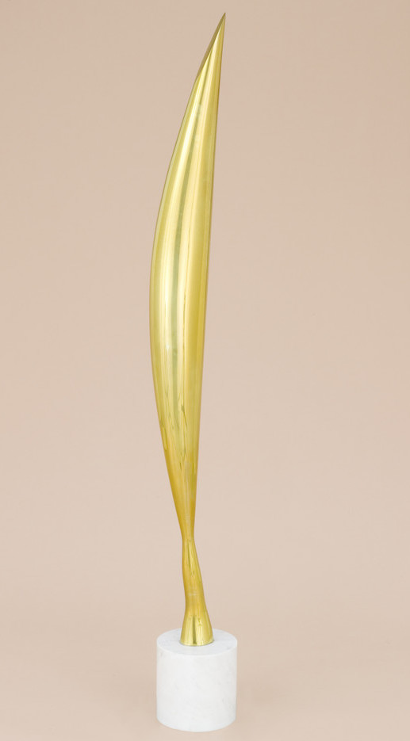
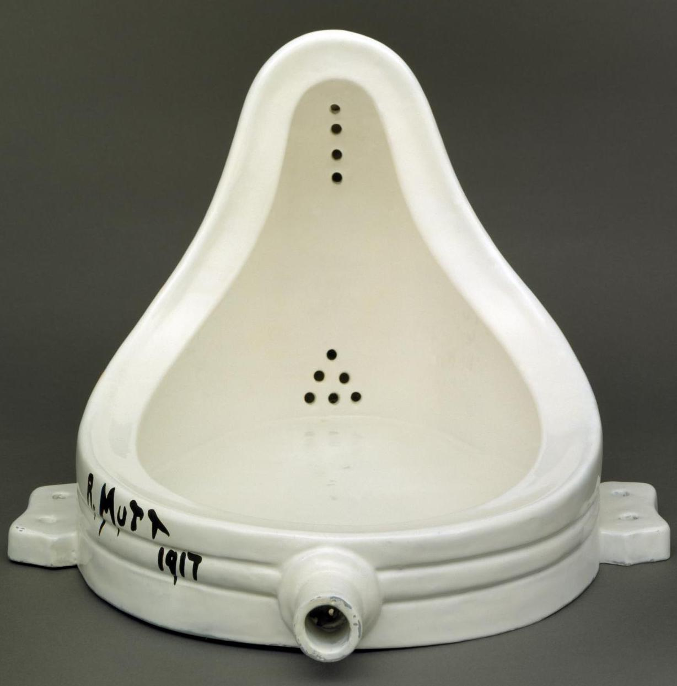
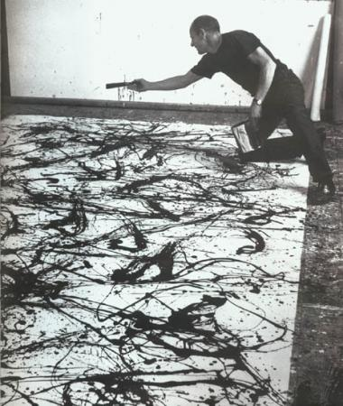
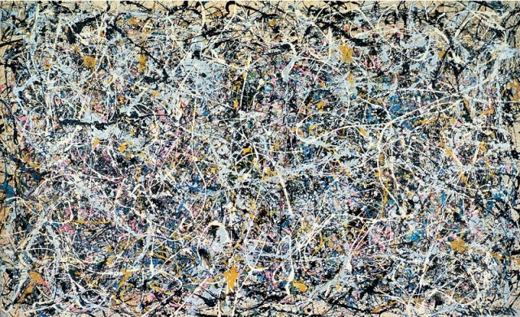
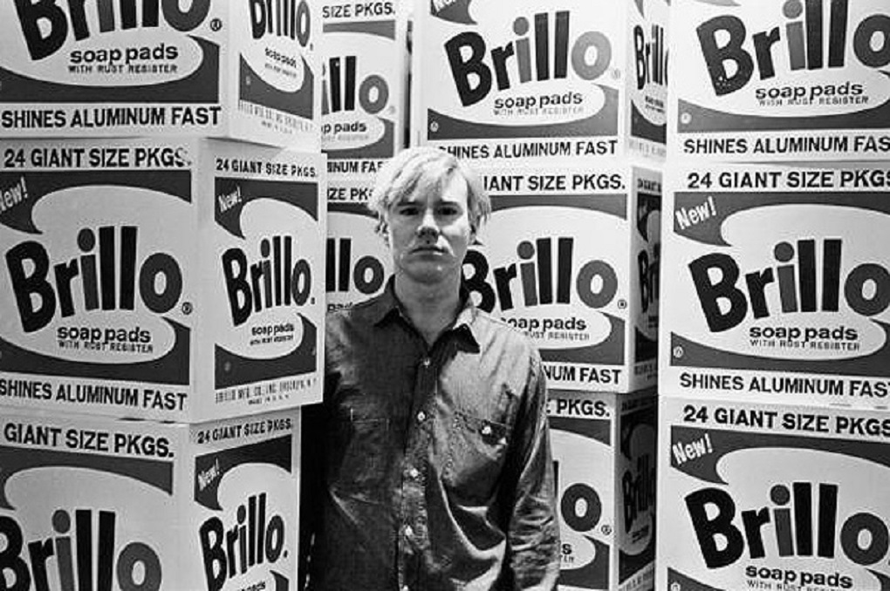
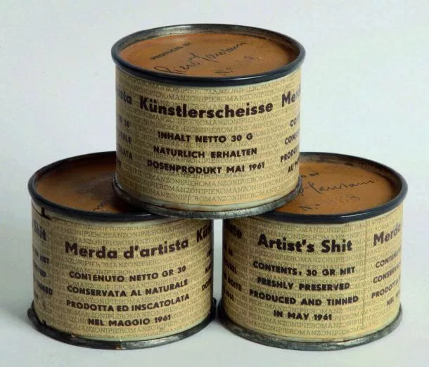

# 3. Un artiste qui n’utilise pas de techniques est-il encore un artiste ?
{: .no_toc }

  

    Sommaire
  

  {: .text-delta }
- TOC
{:toc}

## Exercice 

{: .highlight }
Voir les œuvres d’art contemporain ci-dessous.  
Peut-on encore parler d’art quand les artistes abandonnent les techniques classiques ?

### Constantin Brancusi

| **Le procès Brancusi contre États-Unis**    Le procès intenté par le sculpteur moderne Constantin Brancusi au gouvernement américain en 1927 fait date dans l’histoire de l’art. Le motif : une loi de 1922 prévoyait aux États-Unis la libre importation des œuvres d’art : elles pouvaient passer la douane sans être taxées. Mais les douanes de New York veulent taxer la sculpture “*Bird in space*”, au motif qu’il s’agit d’une pièce industrielle et non d’une œuvre d’art. Le procès fait grand bruit car il incarne la bataille idéologique entre le conservatisme et les avant-gardes artistiques du début du XXe siècle, qui remettent en question le rôle figuratif de l’art.  |     |

### Marcel Duchamp et ses "Ready-made"

| **Marcel Duchamp, *Foutain* (1917)**     |
|------|
| 

    | 
| Fontaine (en anglais : Fountain) est un ready-made de Marcel Duchamp consistant en un urinoir en porcelaine renversé signé « R. Mutt » et daté de 1917. Fountain fut refusée lors de la première exposition de la Société des artistes indépendants de New York en 1917 avant de disparaître. Il n'en existe que des répliques, certifiées par Marcel Duchamp et réalisées dans les années 1950 et 1960. Fontaine passe pour l'œuvre la plus controversée de l'art du XXe siècle et joue un rôle majeur dans le passage de l'art moderne à l'art contemporain. |

<iframe width="560" height="315" src="https://www.youtube.com/embed/45nChbhuOJs?si=_w4smDBYk9kJAJ48" title="YouTube video player" frameborder="0" allow="accelerometer; autoplay; clipboard-write; encrypted-media; gyroscope; picture-in-picture; web-share" referrerpolicy="strict-origin-when-cross-origin" allowfullscreen></iframe>

<iframe width="560" height="315" src="https://www.youtube.com/embed/KKDgFpSkj6I?si=xzwugHNSFDfWXenQ" title="YouTube video player" frameborder="0" allow="accelerometer; autoplay; clipboard-write; encrypted-media; gyroscope; picture-in-picture; web-share" referrerpolicy="strict-origin-when-cross-origin" allowfullscreen></iframe>

### Jackson Pollock

| **Jackson Pollock (1912 - 1956)** est un peintre américain, célèbre représentant du courant de l'expressionnisme abstrait. La pratique du _all-over_ (déposer la peinture de manière homogène sur la toile) ainsi que du *dripping* (laisser couler la peinture sur la toile), qu'il a beaucoup employé de 1947 à 1950, l'a rendu célèbre.  |   | 

| ***Number One* (1949)**   |
|  Dans l’œuvre *Number One* de 1949, on peut ainsi voir que  la matière s’échappe largement de la toile pour atterrir sans doute sur le sol du petit atelier ou même sur les toiles qui bordent les murs.  |
| 

   |

<iframe width="560" height="315" src="https://www.youtube.com/embed/hHZkKch9k6A?si=qwLIy5P0tiKw9SSu" title="YouTube video player" frameborder="0" allow="accelerometer; autoplay; clipboard-write; encrypted-media; gyroscope; picture-in-picture; web-share" referrerpolicy="strict-origin-when-cross-origin" allowfullscreen></iframe>

### Andy Warhol

| **Andy Warhol, _Brillo Box_ (1964)**     | 
|  *Brillo Box* est un ensemble de sculptures fabriquées de bois. En éliminant l'aspect fonctionnel des boîtes et en les retirant de leur cadre habituel, Warhol nous force à les voir sous un nouveau jour et nous fait constater la capacité des techniques de commercialisation de transformer en une marchandise séduisante un objet banal et sans attraits. En même temps, il attire notre attention sur la signification de ces objets qui symbolisent la société de consommation, impersonnelle et commerciale, dans laquelle nous vivons.  |
|  

     |

<iframe width="560" height="315" src="https://www.youtube.com/embed/Rp9i8JM9lMk?si=qOy2c7HDwhRYLuFC" title="YouTube video player" frameborder="0" allow="accelerometer; autoplay; clipboard-write; encrypted-media; gyroscope; picture-in-picture; web-share" referrerpolicy="strict-origin-when-cross-origin" allowfullscreen></iframe>

<iframe width="560" height="315" src="https://www.youtube.com/embed/8G5SiIm_noY?si=0iXPEKPkWVRrN22v" title="YouTube video player" frameborder="0" allow="accelerometer; autoplay; clipboard-write; encrypted-media; gyroscope; picture-in-picture; web-share" referrerpolicy="strict-origin-when-cross-origin" allowfullscreen></iframe>

### Piero Manzoni

|  **Piero Manzoni, *Merda d’artista* (1961)**     |
|  *Merde d'artiste* (ou en italien Merda d’artista) est une œuvre de l’artiste italien Piero Manzoni influencée par les ready-mades de Marcel Duchamp. L'œuvre réalisée en 1961 se compose de 90 boîtes de conserve cylindriques en métal (4,8 × 6 cm), hermétiquement fermées, qui contiennent les excréments de l'artiste, étiquetées, numérotées et signées. |
|   

  |

 

<iframe width="560" height="315" src="https://www.youtube.com/embed/TvF_AFr7UK0?si=Z2U_iEZpHMVTWbUM" title="YouTube video player" frameborder="0" allow="accelerometer; autoplay; clipboard-write; encrypted-media; gyroscope; picture-in-picture; web-share" referrerpolicy="strict-origin-when-cross-origin" allowfullscreen></iframe>

## Arthur Danto, Le Monde de l'art

| Arthur Danto, *Le Monde de l'art* (1988) |
| ------------------------------------------------------------ |
| Ce qui finalement fait la différence entre une boîte de Brillo et une œuvre d'art qui consiste en une boîte de Brillo (Andy Warhol), c'est une certaine théorie de l'art. C'est la théorie qui la fait entrer dans le monde de l'art, et l'empêche de se réduire à n'être que l'objet réel qu'elle est. Bien sûr, sans la théorie, on ne la verrait probablement pas comme art, et afin de la voir comme faisant partie du monde de l'art, on doit avoir maitrisé une bonne partie de la théorie artistique aussi bien qu'une part considérable de l'histoire de la peinture récente à New York. Ce n'aurait pas pu être de l'art il y a cinquante ans. De même, il n'aurait pas pu y avoir, toutes choses restant égales, d'assurance d'avion au Moyen Âge, ni d'effaceurs pour machines à écrire étrusques. Le monde doit être prêt pour certaines choses, pas moins le monde de l'art que le monde réel. C'est le rôle des théories artistiques, de nos jours comme toujours, de rendre le monde de l'art, et l'art, possibles. Je serais enclin à penser qu'il ne serait jamais venu à l'idée des peintres de Lascaux qu'ils étaient en train de produire de l'art sur ces murs. À moins qu'il n'y ait eu des esthéticiens néolithiques. |
| *Qu’est-ce qui fait le statut d’une œuvre d’art, selon Arthur Danto ?* |

