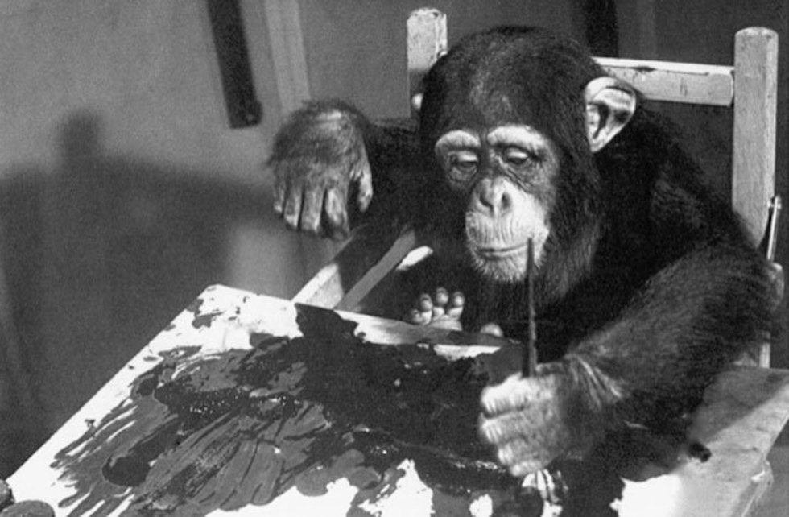
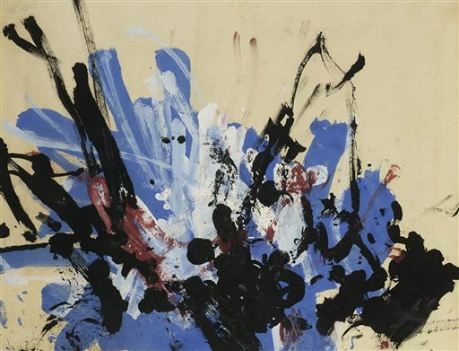
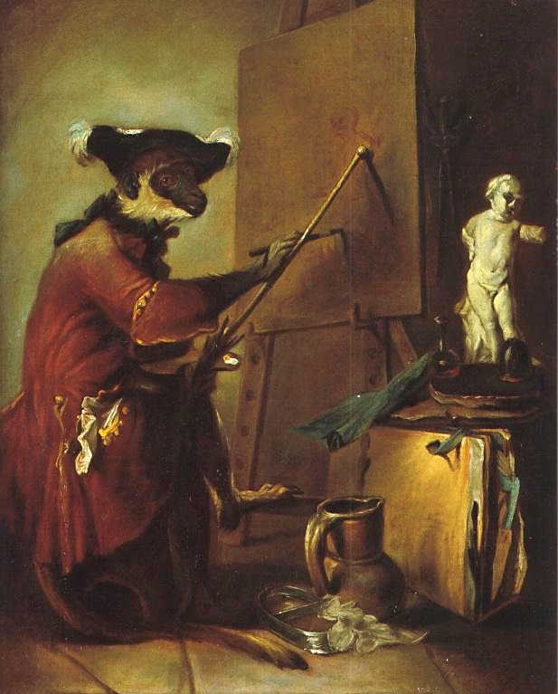
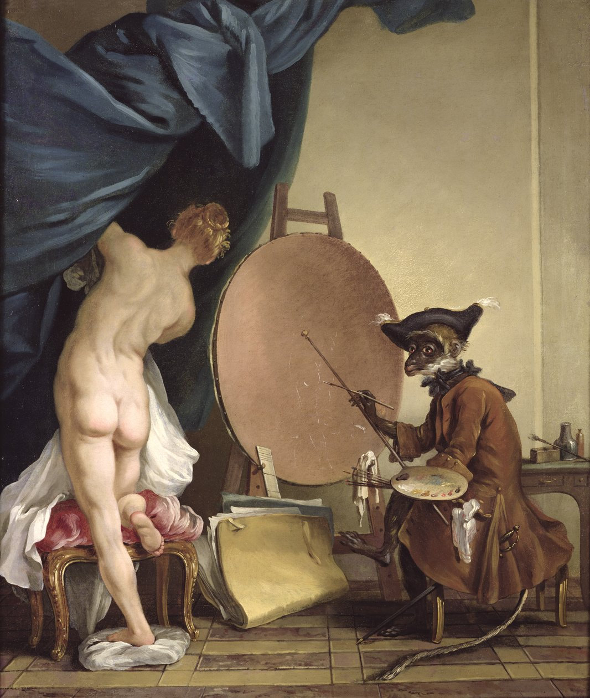

# Introduction : Art et technique
{: .no_toc }

  

    Sommaire
  

  {: .text-delta }
- TOC
{:toc}

## Définitions

{: .note-title }
> Histoire et étymologie du mot « art »
>
> À leur origine, les mots ***ars*** (latin) et ***tekhnè*** (grec) signifient la même chose : “***savoir-faire***”. Nous retrouvons cette racine commune <u>ars</u> dans <u>art</u>iste et <u>art</u>isan. Avant l’époque des Lumières, l’art ne se distingue pas de la technique. 
> 
> Au moyen-âge, la hiérarchie se fait entre “***arts libéraux***” (disciplines intellectuelles) et “***arts mécaniques***” (disciplines manuelles), et pas entre artistes et artisans. Les peintres sont alors considérés comme des artisans. Léonard de Vinci a tenté en vain d’être rattaché aux arts libéraux.   
> 
> “L’Encyclopédie” de Diderot et d’Alembert (1752) invente l’expression “***beaux-arts***” pour distinguer les artistes des artisans. Cela a concerné d’abord les quatre arts qu’on appelle “*arts plastiques*” de nos jours : *architecture*, *sculpture*, *peinture* et *gravure*. Plus tard, la *musique* et les arts de la scène (*théâtre* et *danse*) entreront dans la classification. Puis arrivera le *cinéma* (le septième art), la *photographie* (huitième art) et dernièrement la *bande-dessinée* (neuvième art).

## Congo, le chimpanzé qui peignait

| La maison d'art *Bonhams* organise à Londres, lundi 20 juin, une vente aux enchères peu banale. Trois oeuvres y seront proposées, que certains, en leur temps, avaient qualifiées d'_"expressionnisme abstrait"_. Trois tableaux sur papier datant de 1954, peints d'une main sûre et énergique par un artiste prolifique : le chimpanzé Congo, qui réalisa, entre 2 et 4 ans, quelque 400 dessins et peintures. Les gribouillages d'un singe élevés au rang d'oeuvre d'art ? L'audace en choquera plus d'un. Congo, pourtant, manifesta très tôt pour crayons et pinceaux un intérêt prononcé, vivement encouragé par son propriétaire, l'éthologue Desmond Morris, peintre occasionnel et auteur du célèbre ouvrage _Le Singe nu_ (1967). (*Le Monde*, 14 juin 2005.) |
|  |
| *Congo en train de peindre*    |   
| |
| *Œuvre de Congo*   |

<iframe width="560" height="315" src="https://www.youtube.com/embed/glQSts0p3CM?si=NhgmuppTjROot_Og" title="YouTube video player" frameborder="0" allow="accelerometer; autoplay; clipboard-write; encrypted-media; gyroscope; picture-in-picture; web-share" referrerpolicy="strict-origin-when-cross-origin" allowfullscreen></iframe>

## Jean-Siméon Chardin, *Le singe peintre* (1740)

|  | Ce tableau satirique de Jean-Siméon Chardin (1699-1779) représente un singe devant un chevalet occupé à commencer une toile. Le modèle du singe est une statuette antique de petite taille posée sur une table devant lui. Mais nous pouvons constater que, sur la toile, ce n’est pas l’image du modèle (la statuette antique) qui prend forme, mais les contours vagues d’un animal (qui pourrait peut être un singe, un canard) ou, ce qui est plus probable, non pas une tête d’animal mais un visage humain. | 

## Jean-Baptiste Deshays, *Le singe peintre* (1750)

|  Ce tableau très original par le sujet – un singe peintre au travail devant son modèle – se réfère à une tradition flamande qui a été reprise en France par Watteau et Chardin notamment au XVIIIe siècle. Le personnage du singe réputé imiter ses confrères permet de se moquer de ces artistes sans qualité particulière que la bonne facture et qui reproduisent des recettes d’atelier. |    |

