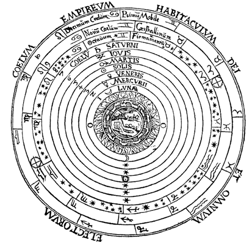
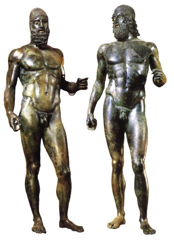

## L'harmonie grecque

### Pythagore, *L’harmonie des sphères*   

| La mathématicien, astronome et philosophe Pythagore (VIe s. av. J.-C.) croyait que les planètes, incluant la Lune et le Soleil, tournaient autour de la Terre en suivant des révolutions circulaires, régulières et constantes et qu’en tournant, elles produisaient des sons. Par analogie, il associait donc l’astronomie à la musique. Il comparait les mouvements des cordes des instruments aux mouvements des corps célestes. Se basant sur ces rapports, Pythagore a établi une gamme cosmique (la gamme pythagoricienne), qui compte sept intervalles et six tons, en s’inspirant du ciel. | <a href="../../assets/img/art/pyth-harmonie.gif" target="_blank">   |

### Les Bronzes de Riace   

|  <a href="../../assets/img/art/bronzi.jpeg" target="_blank"> | Connues aujourd'hui sous le nom de « bronzes de Riace », ces deux statues exceptionnelles ont été découvertes en 1972 par un plongeur amateur. Elles gisaient par huit mètres de profondeur à 300 mètres des côtes de Riace, en Calabre. Elles sont ainsi diversement attribuées à Myron, Hagéladas, Phidias, Alcamène ou Polyclète et ses suiveurs, de célèbres sculpteurs grecs dont certains ne sont connus que par des textes et des répliques romaines. | 

