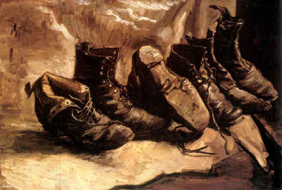

## Vincent Van Gogh, *Trois paires de souliers* (1886)  

| Dans ce tableau, Vincent Van Gogh a regroupé les thèmes de plusieurs de ses peintures de chaussures. L'un est retourné comme un gant, comme dans les _Vieux souliers aux lacets_, un autre est à l'envers, comme dans les _Souliers noirs_ et la paire de _Souliers sur sol bleu_, et il y a enfin des *Bottes sans lacets*. |
| 

   |