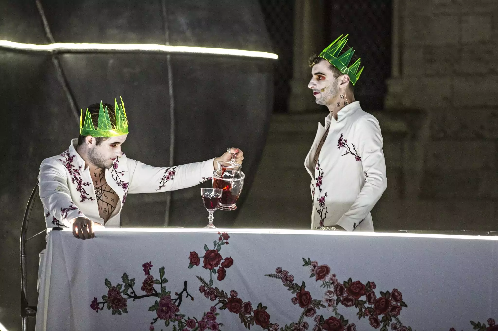

## Sénèque et Thomas Joly, *Thyeste* 
{: .no_toc }

  

    Sommaire
  

  {: .text-delta }
- TOC
{:toc}

### Exercice

{: .highlight } 
Expliquez en quoi Thyeste est une tragédie qui illustre le rôle cathartique de l'art selon aristote.

### Présentation de la pièce

| *Thyeste* est une tragédie de l'auteur romain Sénèque écrite au Ier siècle ap. J.-C. Elle est connue pour la violence de ses scènes illustrant la rivalité entre les deux frères Atrée et Thyeste et en montrant des faits d’infanticide et de cannibalisme. Alors qu'Atrée règne en paix sur Mycènes, son jumeau, Thyeste, séduit sa femme. Atrée se venge de son frère en tuant ses enfants et en les lui servant à dîner. Cette tragédie a été montée en 2018 par le dramaturge Thomas Jolly et présentée au festival d’Avignon dans le Cour d’honneur de la Cité des Papes. |  
| 

    Photographie de la pièce *Thyeste* (Thomas Joly, 2018). Athée invite Thyeste à boire le vin dans lequel se trouve le sang de ses fils.   | 

<iframe width="560" height="315" allowFullScreen src="https://theatre-contemporain.net/images/upload/embed/ceDslNYa"></iframe>

### Vidéo - Bande annonce

<iframe src="https://drive.google.com/file/d/1XqNTBXSfngeuMA-R3v_hMvoJt9tIzMAa/preview" width="735" height="450" allow="autoplay"></iframe>

### Vidéo - Extrait n°1

<iframe src="https://drive.google.com/file/d/1XaGykeqBqLptBGJrlJUNNphC6USPBUuZ/preview" width="735" height="450" allow="autoplay"></iframe>

{: .note-title }
> **Passage correspondant dans l'œuvre de Sénèque**
>
> ATRÉE – Je l'avoue : un désordre affreux trouble mon cœur, et le bouleverse tout entier. Je suis entraîné, je ne sais où, mais je cède à la force qui m'entraîne. La terre mugit, ébranlée jusqu'en ses fondements ; le ciel tonne, quoique sans orage ; ce palais crie comme s'il allait se briser, les dieux lares se sont émus et ont tourné la tête : oui, oui, dieux suprêmes, je le commettrai ce crime qui vous fait horreur.   
> LE GARDE – Que voulez-vous faire, enfin ?   
> ATRÉE – Je sens fermenter dans mon cœur je ne sais quoi d'inouï, d'extraordinaire, et qui dépasse toutes les bornes de la nature humaine ; mes mains frémissent d'impatience ; je ne sais encore ce que c'est, mais c'est à coup sûr quelque chose de grand… Oui, c'est bien ; emparons-nous le premier de cette idée. C'est un forfait digne de Thyeste, et digne d'Atrée ; chacun d'eux en aura sa part. Un repas abominable a été servi dans le palais du roi de Thrace… C'est un crime horrible, je l'avoue, mais un autre l'a commis avant moi. Il faut que ma fureur imagine quelque chose de plus horrible encore. Philomèle et Procné, inspirez-moi. Notre cause est la même ; venez m'aider et conduire mes mains…. Il faut qu'un père déchire avidement et avec joie ses enfants, qu'il mange ses propres membres. C'est bien, c'est assez, ce genre de supplice me plaît, j'en suis content. Où est-il ? Mon innocence me pèse. Toutes les images du crime que je dois commettre sont déjà devant mes yeux, je vois ces enfants mangés par leur père. Mon âme, pourquoi ce retour de crainte ? pourquoi cette défaillance, avant le moment venu ? Allons, du courage ; d'ailleurs, ce qu'il y a de plus épouvantable dans ce crime c'est lui qui le fera.

### Vidéo - Extrait n°2

<iframe src="https://drive.google.com/file/d/1XUYy3UY3pBWx3hlCy40vPkm0UFe8QQcC/preview" width="735" height="450" allow="autoplay"></iframe>

{: .nouveau-title }
> **Passage correspondant dans l'œuvre de Sénèque** 
>
> LE MESSAGER – Plût au ciel qu'il les eût privés de la terre qui couvre les morts et de la flamme qui les consume, pour les faire servir de pâture aux oiseaux, ou les jeter en proie aux bêtes féroces, et fait voir au malheureux Thyeste ses fils sans sépulture ! ce supplice pour lui serait une grâce. — O crime que la postérité ne croira jamais et qu'aucun siècle ne pourra concevoir ! les entrailles arrachées de ces corps vivants tressaillent, les veines palpitent, et le cœur s'agite encore sous l'impression de la terreur ; Atrée a le courage de manier les fibres, et d'y lire la destinée ; il observe attentivement les viscères encore tout pénétrés du feu de la vie. Satisfait des présages qu'il y trouve, il s'occupe tranquillement du festin qu'il veut offrir à son frère. Il coupe les corps en morceaux, il sépare du tronc les épaules et les attaches des bras, met à nu les articulations, brise les os, et ne laisse en leur entier que la tête et les mains qu'il avait reçues dans les siennes en signe de fidélité. Une partie des chairs est embrochée et se distille lentement devant le feu ; l'autre est jetée dans une chaudière que la flamme fait bouillonner et gémir : le feu laisse derrière lui ces effroyables mets, il faut le replacer trois fois dans le foyer pour le forcer enfin à s'arrêter et à brûler malgré lui. Le foie siffle autour de la broche, et je ne saurais dire laquelle gémit plus fort de la chair ou de la flamme, qui, noire comme la poix, se dissipe en fumée. Cette fumée est elle-même sombre et pesante ; elle ne monte pas droite vers le ciel, mais elle se balance dans l'air, et forme autour des dieux Pénates un nuage épais qui les contre. — O Soleil trop patient ! tu t'es retourné en arrière, tu as fermé le jour au milieu de ta course ; mais trop tard cependant. Le malheureux Thyeste déchire ses enfants, et de sa bouche cruelle dévore ses propres membres. Il est là, les cheveux brillants et parfumés, la tête appesantie par le vin. Plus d'une fois son estomac s'est fermé à ces funestes aliments. Malheureux ! le seul bien qui te reste dans ton infortune c'est de ne la connaître pas, mais ce bien même va t'échapper. Quoique le Soleil ait retourné son char, pour suivre une route directement contraire à la sienne, et que la nuit ait devancé son heure pour étendre sur ce crime affreux des ténèbres inconnues, il te faudra pourtant voir, malheureux Thyeste, il te faudra connaître l'excès de ta misère.

### Vidéo - Extrait n°3 : le repas (début)

<iframe src="https://drive.google.com/file/d/1XnAPTUrWl5cg-F0pteA7ahv4GqwOfue6/preview" width="735" height="450" allow="autoplay"></iframe>

### Vidéo - Extrait n°4 : le repas (suite)

<iframe src="https://drive.google.com/file/d/1Xp6PZfaSVgaMUv8eZ-jWE1d6yWGOb36T/preview" width="735" height="450" allow="autoplay"></iframe>