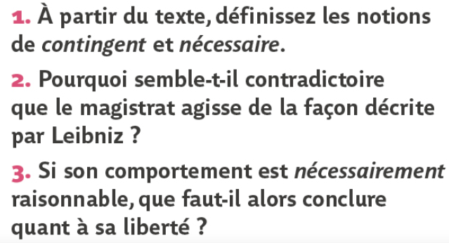
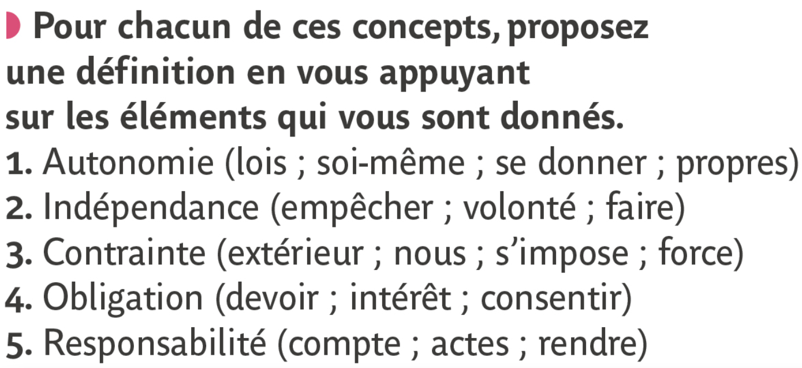

## Déterminisme et liberté, nécessité et contingence 
{: .no_toc }

<details open markdown="block">
  <summary>
    Sommaire
  </summary>
  {: .text-delta }
- TOC
{:toc}
</details>


### Qu’est-ce que le déterminisme ?

```
NOTION COMPLÉMENTAIRE : NATURE
```

| Pierre-Simon Laplace, *Essai philosophique sur les probabilités*, 1825     |
| ---------------------------- |
| Une Intelligence qui pour un instant donné, connaîtrait toutes les forces dont la nature est animée, et la situation respective des êtres qui la composent (...) embrasserait dans la même formule les mouvements des plus grands corps de l'univers et ceux du plus léger atome : rien ne serait incertain pour elle, et l'avenir comme le passé, serait présent à ses yeux. |
| *On parle de “Démon de Laplace” pour désigner l’Intelligence dont parle ici Pierre-Simon Laplace. Pourquoi et comment ce démon pourrait-il prévoir l’avenir ?*   |

{: .nouveau-title }
> Déterminisme (définition)  
>
> On parle de **déterminisme** quand certaines **causes** entraînent des effets **nécessaires**, des effets qui ne pouvaient pas ne pas avoir lieu. Par exemple, si la température de l’eau atteint 100° à 0 mètres d’altitude (cause), elle boue (effet).   
>Le déterminisme affirme donc que **les événements sont nécessaires et réguliers** :
>- Tout a une cause (quelque chose a produit l’ébullition de l’eau)
>- Les causes produisent des effets nécessaires (l’eau qui atteint 100 degrés Celsius produit nécessairement l’ébullition de H2O)
>- Les mêmes causes produisent les mêmes effets (L’eau bout toujours à 100 ° dans les mêmes conditions)
>
>**Le problème est de savoir quels événements sont soumis au déterminisme : seulement les faits naturels, ou aussi ceux qui concernent les êtres humains ?**

### Repères conceptuels : nécessaire et contingent

| G. W. Leibniz, *Essais de Théodicée* (1710)      |
| ------------------------------- |
| L'événement dont l'opposé est possible, est contingent ; comme celui dont l'opposé est impossible, est nécessaire. L'on compte pour impossible qu'un magistrat sage et grave, qui n'a pas perdu le sens, fasse publiquement une grande extravagance, comme serait, par exemple, de courir les rues tout nu pour faire rire. |

| Exercice n°1          | Exercice n°2           |
| --------------------- | -------------------------- |
|  |  |
