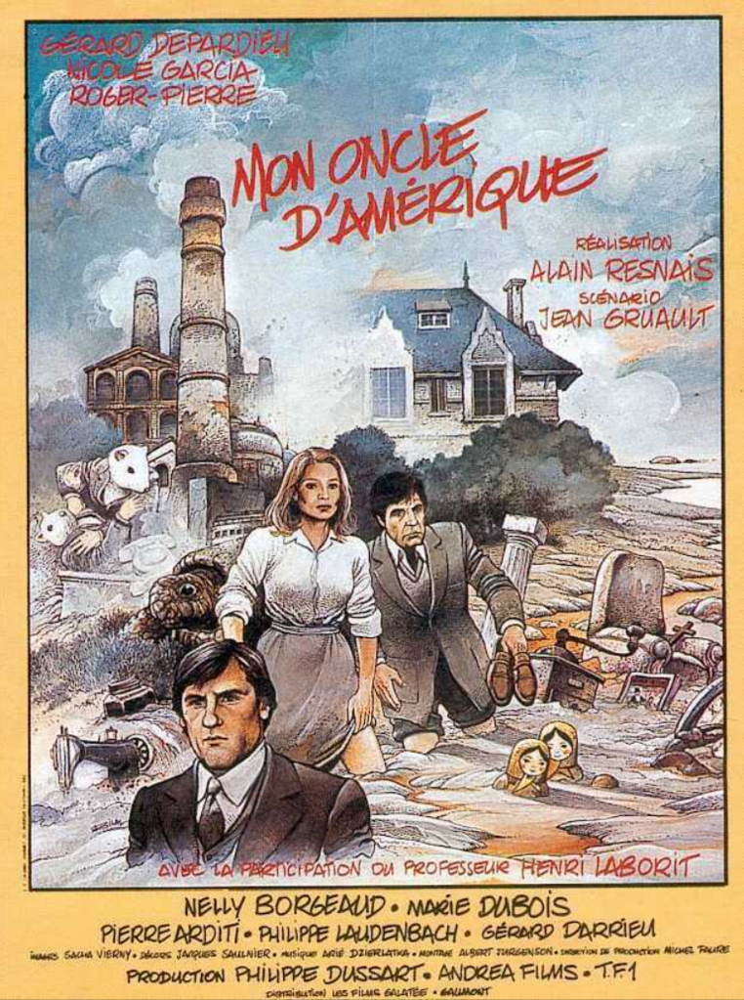
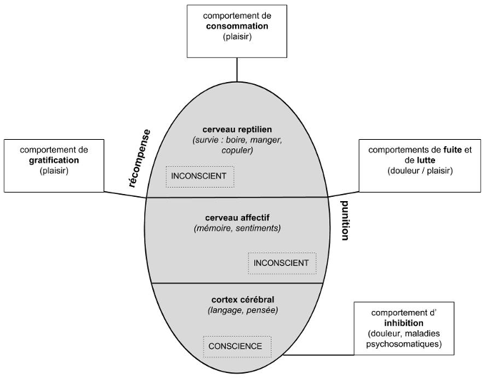

## 2.2. Déterminismes biologiques et psychiques : « Mon Oncle d’Amérique » 
{: .no_toc }

  

    Sommaire
  

  {: .text-delta }
- TOC
{:toc}

### Mon Oncle d'Amérique (Alain Resnais, 1980)

| Ce film raconte le destin croisé de trois personnages dont le comportement est analysé par le biologiste Henri Laborit.  Jean, issu de la bourgeoisie, quitte sa femme pour Janine, une comédienne issue d'un milieu modeste. Ils se séparent. Elle rencontre ensuite René, un fils de paysans qui a fait carrière dans le textile. |  |

### Les trois cerveaux de McLean

#### Présentation

| Les trois cerveaux de McLean       |
| --------------------------- |
| **Dans « Mon Oncle d’Amérique », Laborit reprend les thèses du biologiste MacLean qui décrit en 1958 trois parties de notre cerveau. Marquant trois stades de l'évolution, ces trois cerveaux sont étroitement interconnectés, tout en ayant leur propre intelligence, mémoire, fonction motrice.**  |
| Le **tronc cérébral** (ou **cerveau reptilien**) : Cette zone interne contrôle plusieurs fonctions vitales comme la respiration, le rythme cardiaque, la motricité... Il est le siège des comportements de survie, des comportements automatiques et invariables caractéristiques de l'espèce. Les vertébrés primitifs ne possèdent que cette structure, appelée "cerveau reptilien".          |
| Le **système limbique** : Il est responsable du contrôle des émotions et des motivations. On retrouve cette partie du cerveau, étroitement liée au système olfactif, chez la plupart des mammifères, même les plus primitifs, comme les marsupiaux, les insectivores ou les rongeurs. Il est parfois appelé"cerveau paléomammalien".      |
| Le **néocortex** ou "cerveau néomammalien" : Il est développé essentiellement chez les mammifères les plus évolués comme les carnivores, les ongulés et les primates. Ce cortex a dû se plisser pour augmenter sa surface : les replis ainsi formés ou circonvolutions sont donc un signe d'évolution (cette surface mesure chez l'homme 1,6 m2). Le néocortex est le siège de la plupart de nos fonctions mentales, comme le langage par exemple. Grâce à sa partie frontale il est le cerveau de l'anticipation, du choix face à une stimulation du monde extérieur. |

#### Vidéo explicative

<iframe width="560" height="315" src="https://www.youtube.com/embed/e4v3zLXfncY?si=o8Hk6d5RL8tYgihB" title="YouTube video player" frameborder="0" allow="accelerometer; autoplay; clipboard-write; encrypted-media; gyroscope; picture-in-picture; web-share" referrerpolicy="strict-origin-when-cross-origin" allowfullscreen></iframe>

#### Extrait de "Mon Oncle d'Amérique"

<iframe src="https://drive.google.com/file/d/1MCiJzaoxo6lplbWOcbAYezVEiq-lr0Ac/preview" width="560" height="315" allow="autoplay"></iframe>

{: .note-title }
> Exercice
>
>1. Voir l’extrait de film et répondre : **La conscience nous rend-elle libre, ou ne fait-elle que confirmer ce qui est déterminé inconsciemment par notre cerveau ?**
>2. En quoi la thèse de Laborit confirme-t-elle cette citation de Spinoza ? « *J’appelle libre une chose qui est et agit par la seule nécessité de sa nature ; contrainte, celle qui est déterminée par une autre à exister et à agir d’une certaine façon déterminée.* » 

#### Complément : comparaison avec les 3 fonctions de l'âme 

| Aristote dans son traité De l'âme écrit vers 330 av. J.-C., distingue trois grandes fonctions de l'âme :  1. La **fonction végétative** : la faculté nutritive (appartient à tous les vivants, plantes et animaux, qui croissent) 2. La **fonction sensitive**, qui apparaît chez les seuls animaux: le toucher, le goût, l'odorat, l'ouïe, la vue, la perception du plaisir et de la douleur, le désir. 3. La **fonction intellective**, propre à l'homme : la raison, la pensée. |
| *En quoi les trois parties de l’âme décrites par Aristote correspondent aux trois cerveaux de McLean ?*    |

### Les quatre types de comportements

> « *Chaque chose s'efforce de persévérer dans son être.* »  
> Baruch Spinoza

| Citation d’Henri Laborit dans "Mon oncle d'Amérique"   |
| -------------------------------- |
| On peut donc distinguer quatre types principaux de comportement :    1) **Comportement de consommation**, qui assouvit les besoins fondamentaux.   2) **Comportement de gratification**. Quand on a l’expérience d’une action qui aboutit au plaisir, on essaie de la renouveler.        3) **Comportement qui répond à la punition** ; soit par la **fuite** qui l’évite ; soit par la **lutte** qui détruit le sujet de l’agression.       4) **Comportement d’inhibition** : on ne bouge plus, on attend en tension. Et on débouche sur l’angoisse. L’angoisse c’est l’impossibilité de dominer une situation. |
| *Voir les extraits de film et décrivez les situations qui illustrent ces types de comportement.*      |

#### Extraits de "Mon Oncle d'Amérique"

**Comportement de gratification**   

<iframe src="https://drive.google.com/file/d/1MBgG6zMb5xjP4DosDbOBjcQkibN4o-if/preview" width="560" height="315" allow="autoplay"></iframe>

**Comportement de fuite**   

<iframe src="https://drive.google.com/file/d/1MOkdw72D5msoOiaphso_F0JZ5oOvOY5Z/preview" width="560" height="315" allow="autoplay"></iframe>

**Comportement d'inhibition et de lutte**   

<iframe src="https://drive.google.com/file/d/1MOx2vuKnljH8CbNg89js0Xf-86VI5IKQ/preview" width="560" height="315" allow="autoplay"></iframe>

#### Complément : court-métrage "Hapiness"

"HAPINESS", court-métrage d'animation de Steve Cutts, est l'histoire d'une quête : celle d'un rongeur à la recherche de l'épanouissement et du bonheur.  

<iframe width="560" height="315" src="https://www.youtube.com/embed/e9dZQelULDk?si=tHi0CrUAnQ-cXeZl" title="YouTube video player" frameborder="0" allow="accelerometer; autoplay; clipboard-write; encrypted-media; gyroscope; picture-in-picture; web-share" referrerpolicy="strict-origin-when-cross-origin" allowfullscreen></iframe>