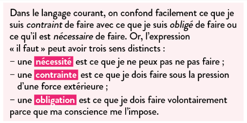
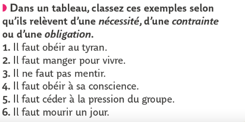

# Introduction : la morale et le devoir
{: .no_toc }

  

    Sommaire
  

  {: .text-delta }
- TOC
{:toc}

## Qu’est-ce qu’un devoir moral ?

{: .note-title }
> COURS
>
>1. **Agir par devoir**, c’est s'obliger à faire quelque chose que l'on pourrait éviter de faire (aider quelqu'un, par exemple). Le devoir est donc synonyme d'**obligation**.     
>2. Cette obligation implique d'avoir le choix, donc d'être libre (si j'aide quelqu'un qui me menace d'une arme, il ne s'agit pas d'une obligation mais d'une contrainte : dans cette situation, je n'aide pas par devoir. Je n'agis pas librement, mais par nécessité). Cette liberté de faire ou ne pas faire une action morale se nomme **liberté morale**.   
>3. Les choix moraux impliquent donc une **responsabilité** : puisque nous avons agi librement, nous sommes responsables de nos actes (= nous avons agi volontairement et en assumons les conséquences). Ceux qui agissent sous la contrainte sont considérés comme irresponsables (ils n'ont pas à assumer leurs actes, car ils ne dépendaient pas d'eux). 

## Nécessité, contrainte et obligation

| Définitions        | Exercice    |
| ---------------------------------- | --------------------------------- |
|  |  | 

| Jean-Jacques Rousseau, *Du contrat social* (1762)      |
| ------------------------------------------------------ | 
| Le plus fort n’est jamais assez fort pour être toujours le maître, s’il ne transforme sa force en droit, et l’obéissance en devoir. De là le droit du plus fort ; droit pris ironiquement en apparence, et réellement établi en principe. Mais ne nous expliquera-t-on jamais ce mot ? La force est une puissance physique ; je ne vois point quelle moralité peut résulter de ses effets. Céder à la force est un acte de nécessité, non de volonté ; c’est tout au plus un acte de prudence. En quel sens pourra-ce être un devoir ? (…)  Qu’un brigand me surprenne au coin d’un bois, non seulement il faut par force donner la bourse, mais quand je pourrais la soustraire, suis-je en conscience obligé de la donner ? Car, enfin, le pistolet qu’il tient est une puissance. |
| *1. Quelle est la différence entre “force” et ”droit” ? 2. Pourquoi le “droit du plus fort” n’est pas réellement un droit ? 3. Selon Rousseau, l'obéissance au brigand est-elle plutôt une nécessité, une contrainte ou une obligation ?*   |

## Morale et éthique

{: .important-title }
> COURS
>
>Lorsque nous agissons et que notre action peut avoir des conséquences sur autrui, nous nous conformons généralement à des devoirs moraux (par exemple : "*respecter autrui*", "*ne pas voler*", "*ne pas mentir*", etc.). Nous agissons donc en fonction d’une certaine <u>morale</u>.
>
>Étymologiquement, le mot “morale” vient du latin *mores*, qui signifie “moeurs” (les habitudes, coutumes, comportements d’un groupe social). **La morale est  l'ensemble des règles de conduite reconnues par les membres d'une société ou d'un groupe de personnes.**
>
>Agir moralement, c’est donc être juste. Au **sens moral**, la justice est synonyme de recherche du bien ou d'acte légitime (chercher la justice, c'est chercher à atteindre ou à faire le bien). Ce "bien" varie selon les morales (cela peut être la générosité, l'égalité, l’épanouissement de l’individu, l’altruisme, etc.).
>
>**La morale** ne devrait pas consister à obéir aveuglément à des règles. Une action réellement morale consiste à **bien agir tout en sachant <u>pourquoi</u> cet acte est bon**. La morale implique une part de réflexion : dans ce cas, elle devient une **éthique** (une morale personnelle, réfléchie). **L'éthique** est donc une réflexion sur les fondements de la morale. Il s'agit de réfléchir à des principes universels, permettant de dégager une définition du bien et du mal, du juste et de l'injuste.

## Complément vidéo Annabac : Le devoir

<iframe width="560" height="315" src="https://www.youtube.com/embed/IX7mubhgukw?si=x01RE7i488gNt8cZ" title="YouTube video player" frameborder="0" allow="accelerometer; autoplay; clipboard-write; encrypted-media; gyroscope; picture-in-picture; web-share" referrerpolicy="strict-origin-when-cross-origin" allowfullscreen></iframe>