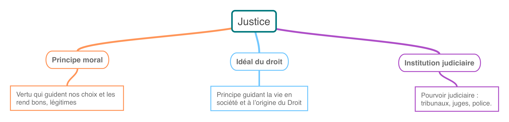

## Qu’est-ce qu’un acte “juste” ?

```
NOTION PRINCIPALE : LA JUSTICE
NOTION SECONDAIRE : L'ÉTAT
```

### Les trois sens du concept de Justice


<a href="../../assets/img/justice-3-sens.png" target="_blank"></a> 


<a href="../../assets/img/exoL41.png" target="_blank"></a> 

#### Complément : vidéo Annabac "La Justice"

<iframe width="560" height="315" src="https://www.youtube.com/embed/oBnaI_LTt7Q?si=I2CJTwAVuK5mlqIV" title="YouTube video player" frameborder="0" allow="accelerometer; autoplay; clipboard-write; encrypted-media; gyroscope; picture-in-picture; web-share" referrerpolicy="strict-origin-when-cross-origin" allowfullscreen></iframe>