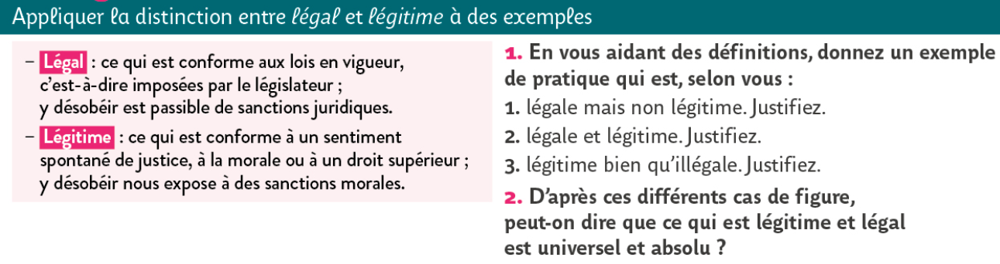

## Qu’est-ce qu’une loi ? Droit et Morale

```
NOTION COMPLÉMENTAIRE : LE DEVOIR
```

{: .note-title }
> LEÇON
> 
> Une loi est une règle qui prescrit ce qu’il faut faire et ne pas faire. Elle autorise et interdit. Y obéir est un devoir, une obligation. Cette obligation peut être morale ou légale.   
> Il faut distinguer les **règles du Droit** et les **règles de la morale** :
> - **Les règles morales** : (1) Elles ne sont pas écrites. Nous les connaissons parce qu’elles nous ont été transmises oralement par notre éducation. (2) Au sein d'une même société, plusieurs morales peuvent donc cohabiter (laïques et religieuses, de droite et de gauche, etc.). (3) Elles déterminent ce qu’il est légitime de faire (**légitime = “juste” au sens moral**). Elles n'ont pas de valeur légale, sauf si elles sont identiques aux lois (par exemple : "*ne pas tuer*" est aussi bien une règle morale qu’une règle de droit). 
> - **Le Droit** : (1) C’est l'ensemble des droits et des devoirs valables dans un pays, inscrits dans un ensemble de codes écrits (code civil, code pénal, etc.). (2) Ces lois concernent donc tous les citoyens, qui doivent obéir aux mêmes règles, quelle que soit leur sensibilité morale (croyance religieuse, conviction politique, etc.). (3) Le droit détermine ce qu’il est légal de faire dans une société (**légal = “juste” au sens juridique** : ce qui est permis ou interdit par la loi).

### Légal et légitime


<a href="../../assets/img/exoL42.png" target="_blank"></a> 

