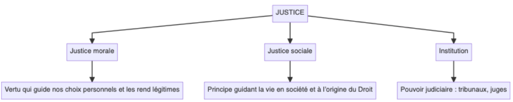
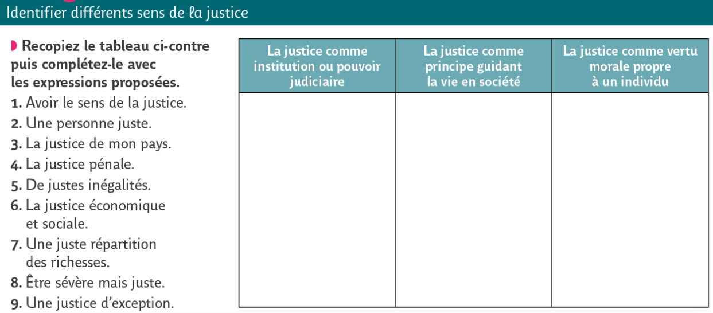
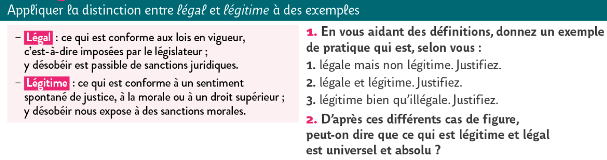
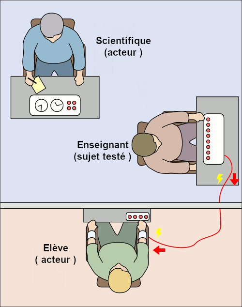

# Introduction : Le droit est-il toujours conforme à la morale ?
{: .no_toc }

  

    Sommaire
  

  {: .text-delta }
- TOC
{:toc}

## Exercice introductif

{: .highlight }
> 1. Analyser les termes du titre de la leçon :  
> - « Peut-il être »
> - « Juste »  
> - « Lois »  
> - « Désobéir »  
> 2. Reformulez la question
> 3. Formulez un problème sous forme de dilemme

## Qu’est-ce qu’un acte “juste” ?

### Les trois sens du concept de Justice

[→ Voir la carte mentale sur la justice](https://rollauda.github.io/schemas/cartes/justice.html){:target="_blank" }  

#### Complément : vidéo Annabac "La Justice"

<iframe width="560" height="315" src="https://www.youtube.com/embed/oBnaI_LTt7Q?si=I2CJTwAVuK5mlqIV" title="YouTube video player" frameborder="0" allow="accelerometer; autoplay; clipboard-write; encrypted-media; gyroscope; picture-in-picture; web-share" referrerpolicy="strict-origin-when-cross-origin" allowfullscreen></iframe>

### Légal et légitime

## Qu’est-ce qu’une loi ? Droit et Morale

{: .note-title }
> ...
> 
> Une loi est une règle qui prescrit ce qu’il faut faire et ne pas faire. Elle autorise et interdit. Il faut distinguer les **règles du Droit** et les **règles de la morale** :
> - **Les règles morales** : (1) Elles ne sont pas écrites. Nous les connaissons parce qu’elles nous ont été transmises oralement par notre éducation. (2) Au sein d'une même société, plusieurs morales peuvent donc cohabiter (laïques et religieuses, de droite et de gauche, etc.). (3) Elles déterminent ce qu’il est légitime de faire (**légitime = “juste” au sens moral**). Elles n'ont pas de valeur légale, sauf si elles sont identiques aux lois (par exemple : "*ne pas tuer*" est aussi bien une règle morale qu’une règle de droit). 
> - **Le Droit** : (1) C’est l'ensemble des droits et des devoirs valables dans un pays, inscrits dans un ensemble de codes écrits (code civil, code pénal, etc.). (2) Ces lois concernent donc tous les citoyens, qui doivent obéir aux mêmes règles, quelle que soit leur sensibilité morale (croyance religieuse, conviction politique, etc.). (3) Le droit détermine ce qu’il est légal de faire dans une société (**légal = “juste” au sens juridique** : ce qui est permis ou interdit par la loi).

## Qu’est-ce qu’obéir ?

### Définition

{: .important-title }
> ...
> 
> L’**obéissance** se distingue de la **soumission** : 
> - **Se soumettre est un acte de nécessité**, qui a lieu lorsqu’on n’a pas le choix. Exemple : je me soumets au voleur qui me menace d’une arme ; je me soumets à un dictateur dans un Etat policier. **Donc, on ne se soumet jamais librement, et l’insoumission n’est possible que quand le rapport de force s’inverse**.
> - **Obéir est un devoir lorsque l’ordre donné ou la loi sont légitimes**. Exemple : l’enfant obéit à ses parents ; le citoyen d’une démocratie obéit aux lois de son pays. **Donc, on obéit librement, car l’obéissance implique la possibilité de désobéir**.

{: .nouveau-title }
> EXERCICE
> 
> Utiliser ces définitions pour expliquer quel type de régime politique est concerné par la question  « *Peut-il être juste de désobéir aux lois ?* »

### Pourquoi obéit-on ? L’expérience de Milgram

| Jacques Lecomte, *Sciences humaines* (n°72, mai 1997)  |
| ----------------------------------------------- |
| Imaginez l'expérience suivante: à la suite d'une petite annonce, deux personnes se présentent à un laboratoire de psychologie effectuant des recherches sur la mémoire, L'expérimentateur explique que l'une d'elles va jouer le rôle de « maître » et l’autre celui d'« élève ». Le maître va soumettre des associations de mots à l'élève, et à chaque fois que celui-ci se trompera, il devra le sanctionner par une décharge électrique. Devant le maître, on attache l’élève sur une chaise et on fixe des électrodes à ses poignets. Puis on introduit le maître dans une autre pièce et on le place devant un impressionnant stimulateur de chocs composé d'une trentaine de manettes allant de 15 à 450 volts. (...) Ces expériences ont effectivement existé (dans les années 60), mais dans des conditions très particulières. L'élève était en fait un comédien professionnel qui simulait la douleur ; le stimulateur de chocs, les sangles et les électrodes n'étaient que des artifices destinés à tromper le maître qui, lui, était le véritable sujet de l'expérience. Car celle-là ne visait pas à contrôler la capacité de mémorisation, mais le niveau de soumission à l'autorité. Or, les résultats sont impressionnants : sur 40 personnes, 26, soit 65% sont allées jusqu'à 450 volts ! Rappelons que dès 330 volts, l'élève ne répond plus, et que des maîtres ont cru qu'il était mort, mais ont néanmoins continué. |
| *1. Que nous apprend l'expérience de Milgram sur les causes de l'obéissance ? 2. Stanley Milgram a raconté son expérience dans son livre « Soumission à l’autorité ». Mais, dans cette expérience, doit-on parler d’obéissance ou de soumission ?*    |

#### L'expérience de Milgram dans "*I comme Icare*"

**Dans le film *I comme Icare* réalité par Henri Verneuil en 1979, une séquence reconstitue l'expérience du professeur Stanley Milgram à l'Université de Yale (1960-1963).**   

<iframe src="https://drive.google.com/file/d/1Rf8LmYPcOFU2G2vLp2ud1rbhanfGP9cR/preview" width="560" height="315" allow="autoplay"></iframe>

<iframe src="https://drive.google.com/file/d/1og6Noj9Tdz_5JLus1A9vqozkmVtXYNH5/preview" width="560" height="315" allow="autoplay"></iframe>

#### Documentaire "*Milgram, obéir ou résister ?*" (10 mn)

<iframe src="https://drive.google.com/file/d/1OY9p7cm1GY5JFM_xdrwpAujXIFluPHgQ/preview" width="560" height="315" allow="autoplay"></iframe>