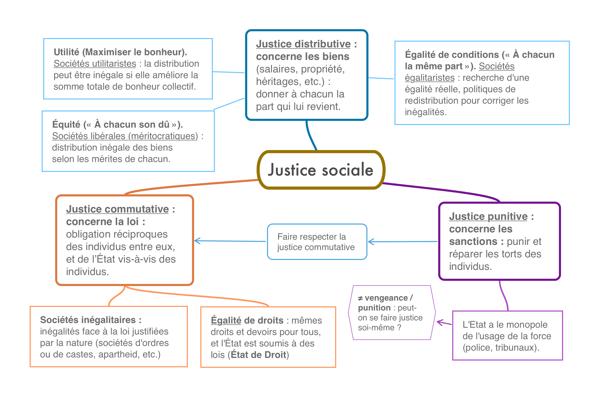

# Introduction : Les principes de la justice sociale  

{: .important-title }
> LEÇON
> 
> Le problème de la justice sociale est de savoir comment une société doit être organisée pour le bien de ses membres. Toute politique vise le bien de la société, mais différentes conceptions du bien ou de la justice sont possibles, d'où la grande diversité de régimes politiques au sein de l'humanité (démocraties, aristocraties, tyrannies, etc.).  
>
>**La justice sociale s’organise autour de trois questions :**
>1. <u>La question de l’égalité</u> : doit-on être égaux devant la loi, avoir les mêmes droits ?
>2. <u>La question de l’équité</u> : comment partager les ressources, les biens produits par une société ?
>3. <u>La question du respect de la loi</u> : comment punir ceux qui désobéissent ?

{: .highlight }
**EXERCICE** : étudier la carte mentale ci-dessous et expliquez, pour chaque dimension de la justice sociale, quels sont les problèmes qui se posent.

 