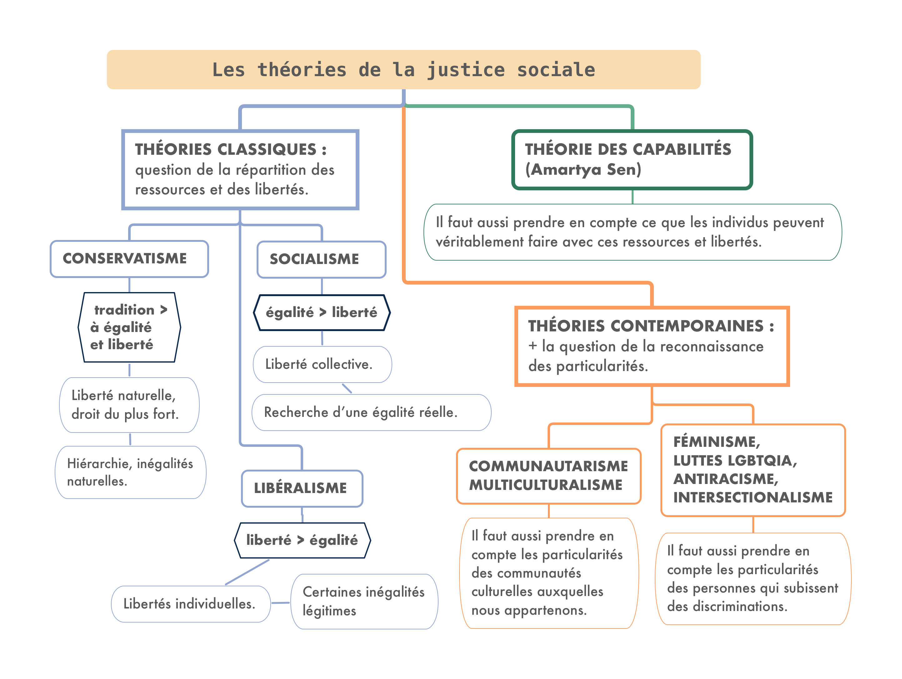
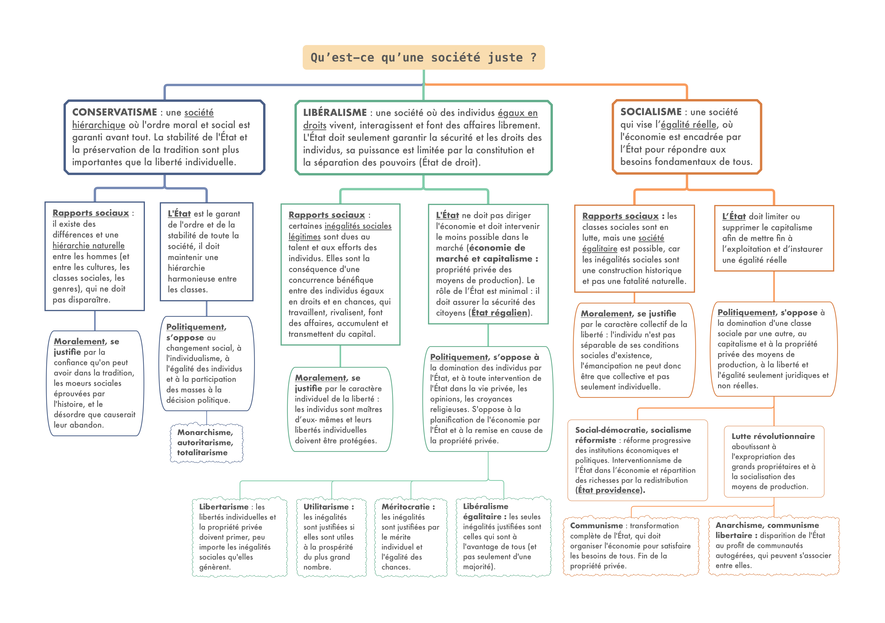

# 2. Comment organiser la société afin qu'elle soit juste ? Justice commutative et distributive 
{: .no_toc }

<details open markdown="block">
  <summary>
    Sommaire
  </summary>
  {: .text-delta }
- TOC
{:toc}
</details>

```NOTIONS COMPLÉMENTAIRES : LIBERTÉ, ÉTAT```

## Activité

{: .note-title }
> Inventer une société juste.
> 
> Vous venez d’échouer avec d’autres personnes sur une île et vous devez fonder une nouvelle société. Pour cela, vous allez vous réunir et utiliser la méthode de la « *position originelle* » et du « *voile d’ignorance* » théorisée par le philosophe états-unien <u>John Rawls</u> (Théorie de la justice, 1971). 
>
>Cela consiste à se couvrir le visage d’un voile symbolique qui cache tout ce qui fait la particularité de chaque individu : derrière ce voile, il vous est impossible de savoir si vous êtes une femme ou un homme, si vous êtes issus d’une famille d’universitaires aisée ou d’une famille d’ouvriers démunie (etc.), si vous avez des enfants, si vous êtes en bonne santé ou malade, croyant ou athée, etc. 
>
>En partant de cette position originelle, vous devez vous accorder avec les autres sur votre future société. 
>
>Vous en écrirez les grands principes de justice en vous interrogeant sur : 
>- <u>Justice commutative</u> : Les droits doivent-ils être les mêmes pour tous ? Quelles sont les grandes libertés fondamentales de votre société ?
>- <u>Justice distributive</u> : comment les ressources, les richesses, doivent-elles être réparties ?
>
>**CONSIGNES :**
- Étudiez les deux cartes mentales suivantes, qui distinguent plusieurs théories de la justice sociale.
- Discutez avec les autres membres du groupe des grands principes de justice de votre société ; prenez des notes
- Écrivez un texte entre une demi-page et une page qui résume vos grands principes de justice.

## Schémas : les théories de la justice sociale

<a href="../../assets/img/L6/theories-justice.png" target="_blank"></a> 

<a href="../../assets/img/L6/societe-juste.png" target="_blank"></a> 

## Compléments vidéo

{: .highlight }
Pour approfondir votre connaissance des différentes théories de la justice, vous pouvez consulter [-> les vidéos de la playlist "Les théories de la justice" de la chaîne Youtube "Philoxime"](https://www.youtube.com/playlist?list=PLyh4DKd62N23ndUHcANlH5_6Zr3ZBCsj7){:target="_blank" }. ou [celles sur le contractualisme de la chaîne Politikon](https://www.youtube.com/playlist?list=PLbrpVZEv5OSCOXMyQ3KJQe-DJRzcswnbH){:target="_blank" }

<iframe width="560" height="315" src="https://www.youtube.com/embed/OIKwI5qu4y8?si=VYx2R4VlofEKXlII" title="YouTube video player" frameborder="0" allow="accelerometer; autoplay; clipboard-write; encrypted-media; gyroscope; picture-in-picture; web-share" referrerpolicy="strict-origin-when-cross-origin" allowfullscreen></iframe>

<iframe width="560" height="315" src="https://www.youtube.com/embed/xqfB844lV4k?si=lQXNpp-1RwZzUQf_" title="YouTube video player" frameborder="0" allow="accelerometer; autoplay; clipboard-write; encrypted-media; gyroscope; picture-in-picture; web-share" referrerpolicy="strict-origin-when-cross-origin" allowfullscreen></iframe>


