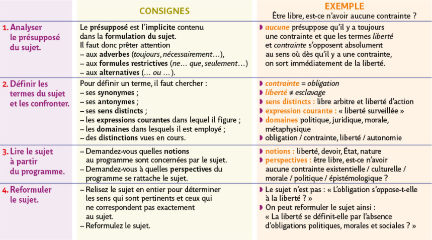
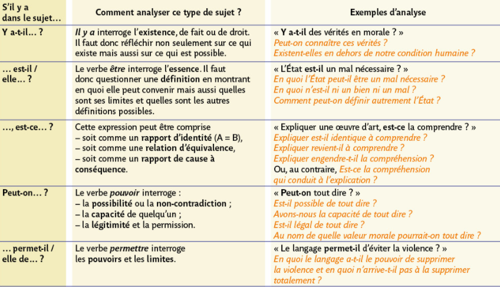
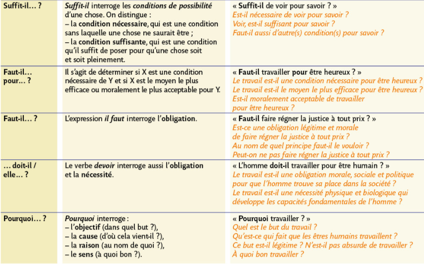
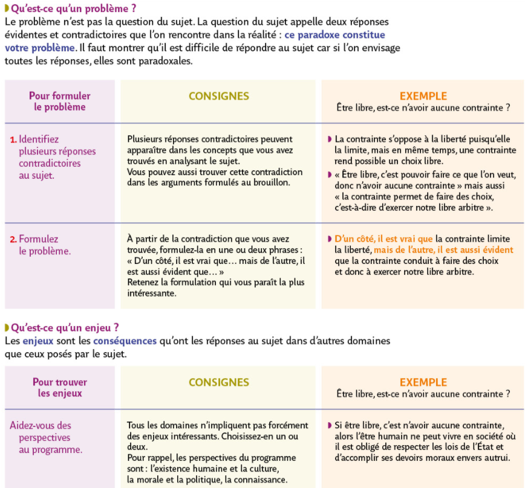

##  Analyser et problématiser une question philosophique
{: .no_toc }

  

    Sommaire
  

  {: .text-delta }
- TOC
{:toc}

### Fiche-méthode

{% pdf "../../assets/pdf/methode/M0-fiche-question.pdf" width=90% height=700px no_link %}

### Manuel Bordas

**Cliquer sur les images pour les ouvrir en grand**  

#### Analyser un sujet p. 494

#### Formulations types de sujets p. 495

#### Problématiser un sujet p. 500

