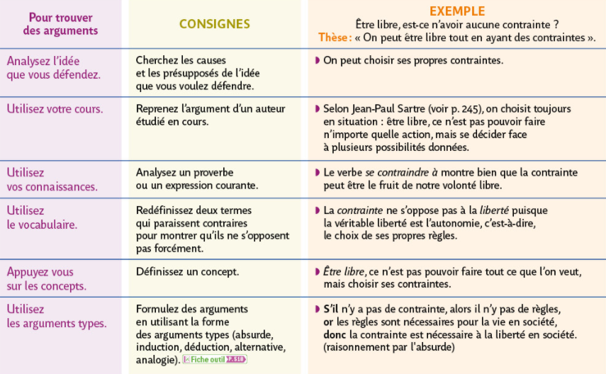
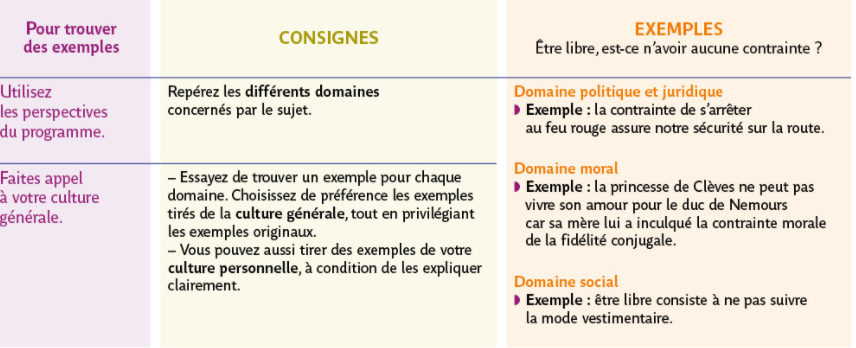
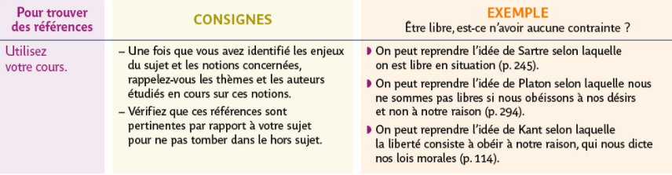
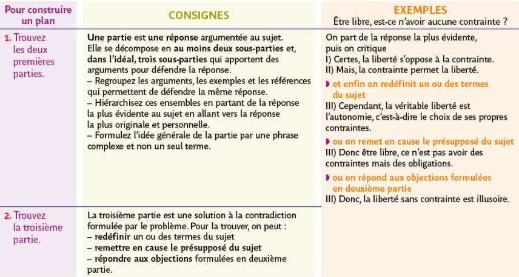
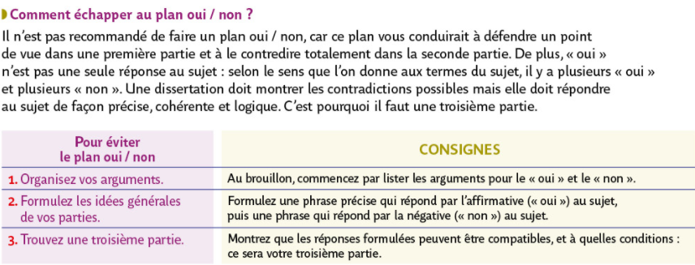
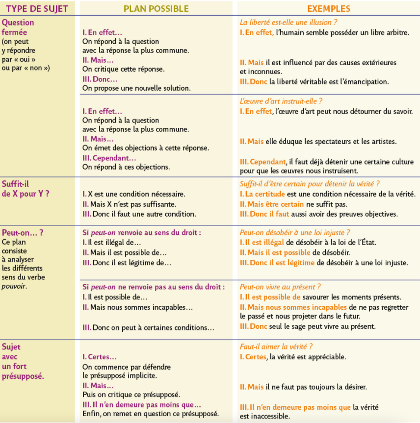

##  Méthode de la dissertation
{: .no_toc }

  

    Sommaire
  

  {: .text-delta }
- TOC
{:toc}

### Fiche-méthode

{% pdf "../../assets/pdf/methode/M1-methode-dissertation.pdf" width=90% height=700px no_link %}

### Manuel Bordas

**Cliquer sur les images pour les ouvrir en grand**  

#### Construire des arguments, exemples et références p. 496-497

#### Consrtuire le plan p. 502-503

