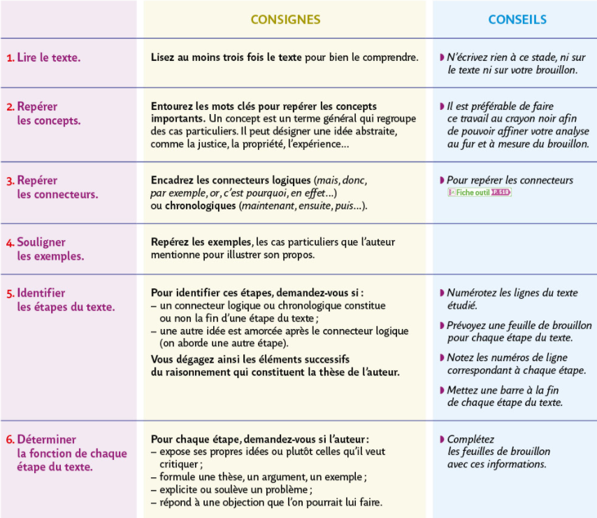
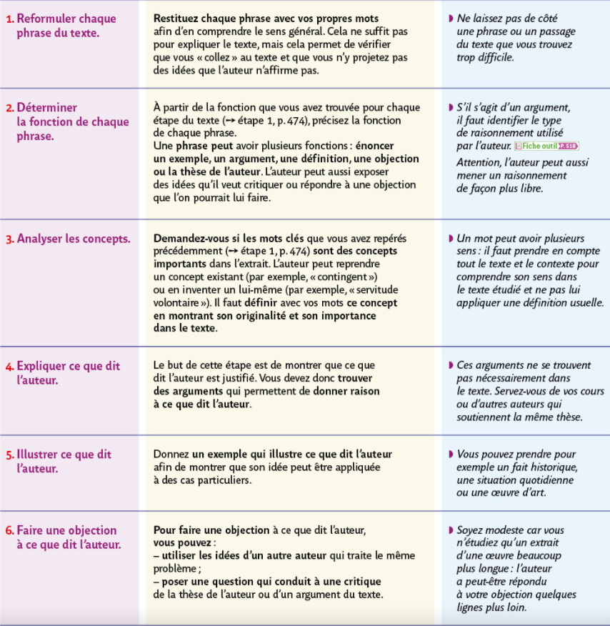

## Lire et comprendre un texte philosophique
{: .no_toc }

  

    Sommaire
  

  {: .text-delta }
- TOC
{:toc}

### Fiche-méthode

{% pdf "../../assets/pdf/methode/M2-lire-texte-philo.pdf" width=90% height=700px no_link %}

### Manuel Bordas

**Cliquer sur les images pour les ouvrir en grand**  

#### Identifier la structure du texte p. 474

#### Analyser le texte pas à pas p. 476

