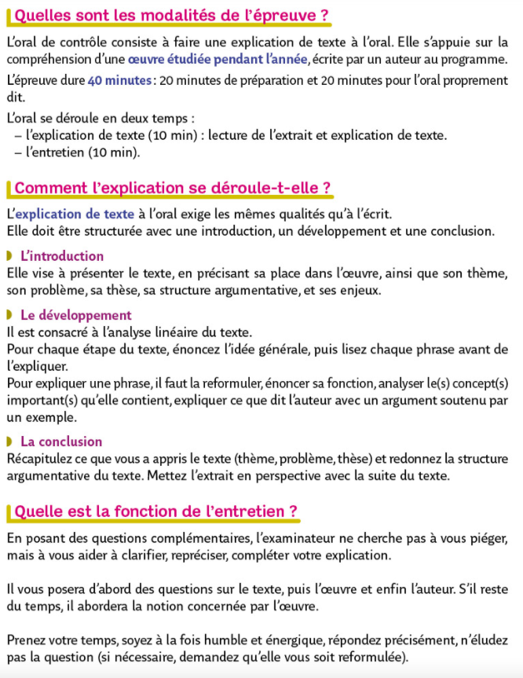

## L'oral de rattrapage

{: .highlight }
Si vous avez entre 08/20 et 10/20 au baccalauréat après les épreuves écrites, vous êtes autorisés à passer une épreuve de rattrapage, aussi nommée "Oral de second groupe". Vous devez choisir 2 matières parmi vos deux spécialités et la philosophie. Les notes que vous obtiendrez à l'oral remplaceront vos notes obtenues à l'écrit.   

